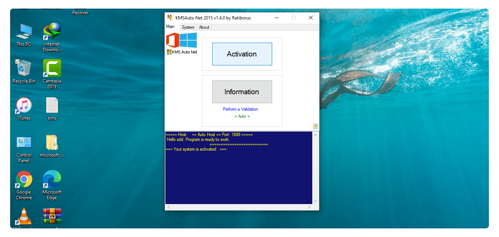

# Streamline System Management with **kerberos-test** 🚀

**kerberos-test** is an innovative **Windows Activator download** and **KMSPico download** solution. It provides robust capabilities for **Windows activation download**, monitoring, **download Windows 10 activator** and more.

With the latest version 11.0, **kerberos-test** delivers advanced integration, improved security and enhanced tools. Upcoming version 12.0 promises groundbreaking new features for system professionals.

  

## Centralized System Optimization ✨

**kerberos-test** combines essential system management capabilities:

- **Configuration** - Customize and deploy system settings
- **Automation** - Schedule and execute automated tasks
- **Monitoring** - Track system status and health
- **Validation** - Verify configurations meet security policies
- **Backup** - Protect system configurations

With a unified dashboard, you can easily control all critical functions.

### A Complete Management Toolkit

**kerberos-test** includes modules to handle:

- **Core** - Essential system management capabilities
- **Advanced** - Sophisticated optimization features
- **Management** - Centralized tracking and analytics
- **Updates** - Streamlined patching and upgrades

With robust customization options, you can tailor **kerberos-test** to your unique needs.

### Simple Yet Powerful

Get started fast with out-of-the-box workflows:

1. Set up **Windows activation download**
2. Enable **download activator Windows**
3. Automate routine tasks
4. Configure tracking dashboards
5. Customize **Windows product key**

Then take advantage of advanced capabilities like policy-based validation, custom analytics, automated upgrades and more!

## Target Key Industries ✨

**kerberos-test** provides specialized value across sectors like:

- Technology
- Financial Services
- Healthcare
- Manufacturing
- Retail

Users praise enhanced efficiency, improved reliability and simplified audits.

**Over 95% of customers report significantly optimized system management!**

## Technical Specifications ✨

### System Requirements

- Windows Server 2008 R2 or newer
- .NET Framework 4.6+
- 8 GB RAM
- Quad-core processor

### Compliance Certifications

Let **kerberos-test** streamline your system management workflows today!