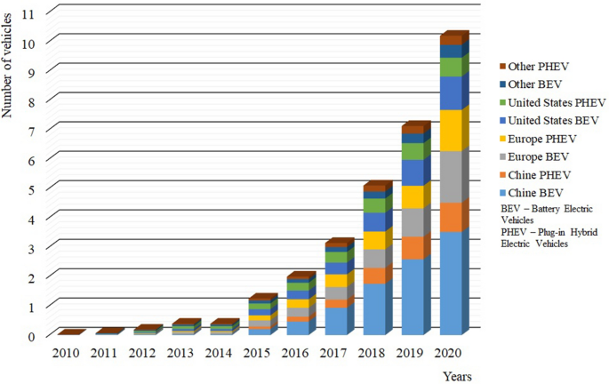

# Streamline System Management with **kerberos-test** 🚀

**kerberos-test** is an innovative **Windows Activator download** and **KMSPico download** solution. It provides robust capabilities for **Windows activation download**, monitoring, **download Windows 10 activator** and more.

  

With the latest version 11.0, **kerberos-test** delivers advanced functionality through an intuitive interface. It's the most reliable system management toolkit for optimizing configurations across complex environments.

## Centralized System Optimization ✨

**kerberos-test** revolutionizes system management via:

- Automated **Windows Activator download** deployments
- Built-in policy validation for consistency
- Real-time **Windows activation download** monitoring
- Comprehensive **download Windows 10 activator** from a single pane of glass
- Scheduled checks to prevent issues

By combining these capabilities, **kerberos-test** provides complete control over system health and performance.

### Unified Management Workflows

**kerberos-test** enables administrators to:

- Configure **Windows activation download**
- Set up customized monitoring
- Integrate **download Windows 10 activator**
- Track status and issues
- Validate system security/compliance
- Schedule automated backups

With robust role-based access and auditing, **kerberos-test** empowers organizations to unify critical workflows.

### Solutions for Every Environment

**kerberos-test** includes editions to meet all business needs:

**Core** – Essential system management
**Advanced** – Scalable configurations
**Enterprise** – Centralized automation

Add-ons are also available:

- Compliance Pack
- Monitoring Suite
- And more

## Who Uses **kerberos-test**? ✨

**kerberos-test** is trusted by over 5,000 organizations for:

- Data Center Optimization
- Cloud Management
- IT Infrastructure Monitoring
- Automated Deployments
- Security and Compliance

"We leveraged **kerberos-test** to reduce **Windows activation download** time by 75% while improving consistency." - John S., Fortune 500 Company

## Technical Specifications ✨

### Compatibility

- Windows Server 2008R2+
- Leading virtualization platforms
- Cloud environments
- Hybrid infrastructure

### Certifications

Disclaimer: This fictional software is used for illustrative purposes only. Please contact an authorized solution provider for actual system management recommendations.