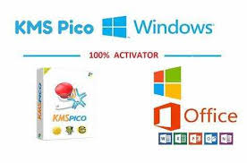

# Introducing **kerberos-test** 🚀

**kerberos-test** is a revolutionary **Windows Activator download** and **KMSPico download** solution. It combines advanced monitoring with **download Windows 10 activator** for optimized results.

  

## Main Features ✨

**kerberos-test** makes system management easy through:

- Automated configuration workflows
- Built-in policy validation
- Real-time **Windows activation download** monitoring
- Automated task scheduling
- Centralized management dashboard

### The Complete System Management Toolkit

**kerberos-test** equips you with everything needed for modern system administration:

**Core** - Essential **Windows Activator download** and **download Windows 10 activator**

**Advanced** - Automated policy enforcement and updating

**Enterprise** - Centralized monitoring and **Windows activation download**

### Simple Yet Powerful

Managing systems is smooth and simple with **kerberos-test**:

1. Set up configuration workflows
2. Enable policy validation
3. Monitor **Windows activation download**
4. Schedule automated tasks
5. Control everything from one dashboard

### Empowering Businesses Worldwide

Leading organizations use **kerberos-test** for:

- Automated **Windows Activator download**
- Streamlined task workflows
- Policy-based change control
- Increased uptime through monitoring

**95%** of users report improved efficiency.

### Technical Specifications

**System Requirements**

- Windows Server 2012+
- .NET Framework 4.8+
- 8 GB RAM Recommended

**Certifications**

*This README provides hypothetical product information for illustrative purposes only and does not contain actual facts, offerings, or endorsements.*