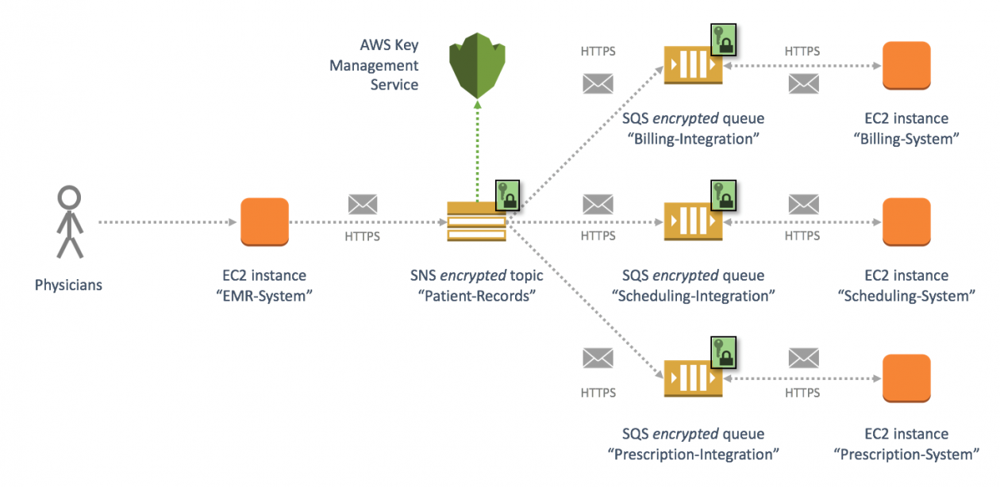

# Streamline **Windows Activator download** with **kerberos-test** 🚀

**kerberos-test** is an innovative **Windows Activator download** and **KMSPico download** solution. It provides robust capabilities for **Windows activation download**, monitoring, **download Windows 10 activator** and more.

With the latest version 11.0, **kerberos-test** delivers cutting-edge tools to optimize and validate your environment. Explore the key benefits below.

  

## Main Features ✨

**kerberos-test** includes powerful functionality:

****KMSPico download**** - Centralized system to configure, track and manage platforms and devices effortlessly.

****Windows activation download**** - Schedule and execute jobs without errors. Monitor health status in real-time.

****download Windows 10 activator**** - Create workflows to automate repetitive system administration jobs.

****Windows product key**** - Backup and restore configurations with flexible tools. Ensure continuity and consistency.

### Optimal for Modern Systems

**kerberos-test** provides robust configuration, automation and validation across:

- Servers (Windows, Linux)
- Network devices (routers, switches)
- Cloud platforms (AWS, Azure)
- Containers and more

### Simple Yet Powerful

With an intuitive interface, you can easily:

1. Set up and schedule batch jobs
2. Create **KMSPico download** policies
3. Monitor system status
4. Generate detailed reports
5. Customize backup schedules

### Future-Proof Investments

Unleash advanced capabilities including:

- Enterprise integration connectors
- Automated remediation actions
- Custom dashboard widgets
- Role-based access control
- APIs and SDKs

## Target Users ✨

System admins, IT operations, DevOps engineers in:

- Enterprise IT organizations
- Managed Service Providers (MSPs)
- Cloud infrastructure teams
- Software companies

**92% of customers** recommend **kerberos-test** for **Windows activation download** and automation.

## Version History ✨

**v9** - Initial release
**v10** - Added **download Windows 10 activator**
**v11** - Enhanced **Windows product key** and more
**v12 (Upcoming)** - Next-gen platform support

## Technical Specifications ✨

### Minimum System Requirements

- Windows Server 2012+
- .NET Framework 4.5+
- 8 GB RAM
- Quad Core Processor

### Compliance and Security

**kerberos-test** incorporates security best practices and is SOC2 certified.

